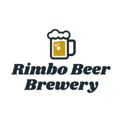
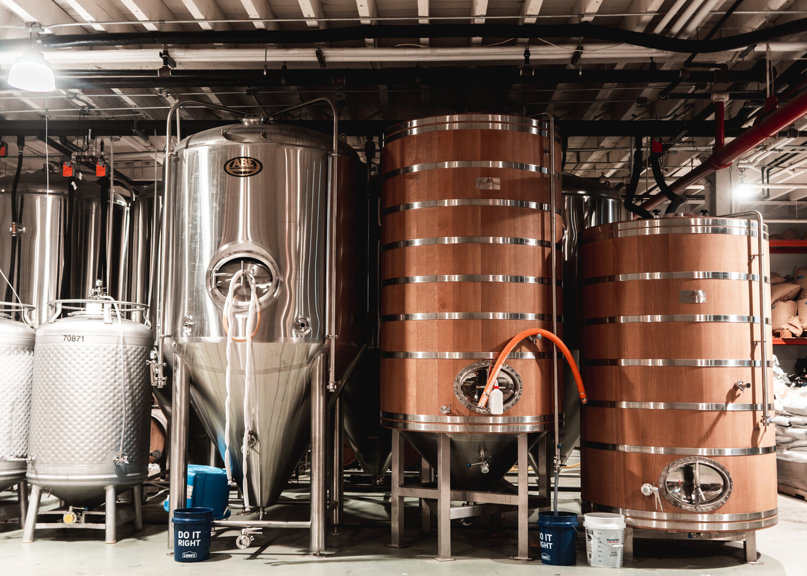

# Rimbo Beer Brewery.

## Features

- Index page, a minimalistic homepage whit the brewery moto
- Our beers, page whit the brewerys beers
- Contact page, page for contact information
- Beer tours page, for the brewerys tours times and whats the tour includes.

## Existing Features

-__ Navigation Bar __

-Featured on all 4 pages is the navigation bar responsive 1200px and 950px whit links to, index page, our beers, contact and brewery tours. and is identical in each page to allow for easy navigation.
- This section makes easy accsess to the full page whit a simple and easy to use navigation bar, without having to use the back button.

## picture of nav bar

-__The landing page image__

  - The landing includes a photograph whit the brewery logo to allow the user to see exactly what the site is for.
  - This section introduces the user to the brewery.

## picture of hero image and logo

-__Our vision section__

  - The our vision section on the landing page will allow the user to see the brewerys vision,
  - This user will see that the brewery is a craftsmanship dedicated to providing the best product.  
  - This should encourage the user to explore the site more. 
  - whit images of the 3 diffrent beer styles that the brewery provides at this point. 

## picture of the vision message

-__The Footer__ 

  - The footer section includes links to the relevant social media sites for The brewery. The links will open to a new tab to allow easy navigation for the user. 
  - The footer is valuable to the user as it encourages them to keep connected via social media
  - its fixed at the bottom left of the page for easy accsess at all times.
  - copyright of the author

## picture of the footer

-__Our beers__

  - The our beers will provide the user with supporting images and and explenation of what to expect when tasting the beer.
  - This section is valuable to the user as they will be able to easily identify the diffrent beers the brewery makes and a short explenation of what to expect when tasting 

## picture of our beers 

-__Beer tours__

  - This page will allow the user to see what times and dates the brewery has its tours of the brewery The user will be able specify if they want to take a tour with tasting and dinner at the brewery.
  - at the bottom there is contact information to the brewery for booking of the tour.

## picture of Beer tours

-__Contact__

-This page will have the location of the brewery in google maps.
-Form for sending a message to the brewery with questions or ordering the brewery beers to their resturant or bar.

## Features left to implent

- More beer that the brewery makes
- links to resturants and bars that has the brewery beers in stock
- an pop up for confirming the age of the user at the start page
- popup for accepting cookies
- slide show of pictures of the brewery on the header image

## testing

### Validator testing

- HTML
  - No errors were returned when passing through the official [W3C validator](Link to the test)
- CSS
  - No errors were found when passing through the official [(Jigsaw) validator](Link to the test)

## Deployment

- The site was deployed to GitHub pages. The steps to deploy are as follows: 
  - In the GitHub repository, navigate to the Settings tab 
  - From the source section drop-down menu, select the Master Branch
  - Once the master branch has been selected, the page will be automatically refreshed with a detailed ribbon display to indicate the successful deployment. 

The live link can be found here - Link to the live site

## Credits

All code was written by the developer.
whit support from the slack community

### Content

- The text for the Home page was writen by the developer
- The text for the tast of the beer was taken from https://www.tastings.com/
- The icons in the footer were taken from [Font Awesome](https://fontawesome.com/)
- the page is made up and not a real brewery.

### Media 

- The images  used on all the pages was taken from https://www.istockphoto.com/

  
